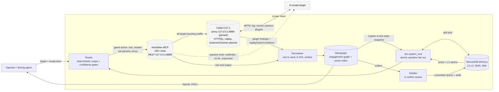

# Jcyber — Plan to Chain Five Systems

## 1. Goal

One framework for running bug bounty / pentest engagements where:

1. **Nothing is decided by vibes** — every control decision is a typed Jev question with a confidence score, or a deterministic rule.
2. **No state is lost** — the session survives restarts (Memgraph) and the engagement survives engagement boundaries (TencentDB).
3. **Every finding is traceable** — raw evidence → hypothesis → finding → attack chain → report, with IDs per the Prometheus doctrine.
4. **Every action is gated** — scope check (deterministic + modeled) and confidence thresholds gate all HexStrike execution.

## 2. Roles

| Component | Owns | Explicitly does NOT do |
|---|---|---|
| **HexStrike** | Tool execution. 150+ tools (nmap, subfinder, nuclei, ffuf, katana, sqlmap, httpx, …) via MCP; process management; raw output. REST face on `:8888` (its own default; the Caido proxy is pinned at adjacent `:8889`, so the pair stays one off). | **No decision-making.** Its v6 "Intelligent Decision Engine" and 12 "AI agents" overlap directly with Jev's role — Jcyber uses HexStrike as a *tool server* (`/api/command` + MCP tool primitives) and ignores its decision layer. |
| **Jev** | Fast structured judgment: next action, hypothesis support, severity, bounty potential, dedup class, chain probe, report readiness, skill selection, **engine routing** (`route_via_engine` — one atomic question, evidence-only output). All judgments are atomic questions (fan-out: many questions, one call). | No memory, no execution, no unstructured text generation into the control path. |
| **Memgraph** | The live engagement graph: scope, assets, endpoints, hypotheses, evidence, findings, attack chains, tool runs, **decision audit log**. Vector index for evidence dedup; multi-hop traversal for attack-chain discovery. | No cross-engagement memory (that's TencentDB). No raw artifacts (that's the vault). |
| **TencentDB** | Cross-engagement memory: L0 conversations → L1 atoms ("vendor X's WAF strips `X-Forwarded-For`") → L2 scenarios → L3 persona; **Skill assets** (reusable procedures like "sequential-ID IDOR probe"); Wiki of vendor notes; ACL'd agent loadouts. | No in-session state. It is queried at recall and written asynchronously at commit. |
| **Prometheus** | The doctrine, compiled down: ID model, finding lifecycle rules (no stage skipping, evidence required, conservative severity), engagement directory layout, learning-loop files, authorized-scope-only rule. | Not a runtime. Jcyber keeps its *schemas and invariants* and implements the mechanisms natively in graph + code. |

**Caido — the traffic substrate (infra, not a sixth system):** every
target-touching call HexStrike makes flows through Caido's local proxy
(pinned at `127.0.0.1:8889` — one above HexStrike's own REST on
`:8888`, so the two ports stay one off by construction). Caido owns the
wire: interception, request logging, HTTPQL, edit-and-replay with the
session's cookies/auth headers intact, and passive plugins (Autorize's
low-priv/no-auth triple replay, Scanner's template checks). Both plugins
are Caido-official and documented in passive AND active modes; Jcyber
drives passive only (active scans are never dispatched by the loop). One
Caido project per engagement, always created fresh at intake with its
allow-scope derived from `scope.toon`. **What Caido does NOT do:
decide.** Its plugin verdicts and findings are *evidence* — they enter
the normalizer as `:Evidence` rows (`tool: 'caido/…'`) and support or
contradict hypotheses through the existing gates, no differently from
HexStrike output.

**The chain in one sentence:** TencentDB recalls priors into Jev; Jev decides on the Memgraph state snapshot; the gate checks scope + confidence; HexStrike acts; the normalizer writes evidence back into Memgraph; the learning step distills durable atoms into TencentDB.

## 3. Architecture



Keep in sync with [`docs/diagrams.md`](docs/diagrams.md) (the canonical
copy, which also carries the per-iteration decision gate) — when the
architecture changes, edit the diagram there and mirror it here.

Data flows one way except the operator interface. TencentDB is **read at recall, written at commit** — never in the hot path, so its latency/weight never blocks a loop iteration. All of the above is the decision path — Caido is not on it. The cylinder nodes (`HexStrike`, `Caido`, `Memgraph`, `TencentDB`) are the substrate the loop runs on: data still flows one way across every edge into `DEC`, and Caido has no edge toward the gate — one way in with findings, never with opinions.

## 4. The chain, step by step

### 0 — Intake & scoping
- Operator provides target + scope (in-scope hosts/paths, program rules, out-of-scope items).
- Orchestrator creates the engagement:
  - working dir per `schema/storage-layout.md`,
  - fresh Memgraph schema (`schema/memgraph/engagement-graph.cypher`) with scope nodes inserted,
  - engagement registered in TencentDB (team/agent binding; visibility `private` by default).
- **Scope is authoritative and mutable only by the operator.** It is the input to every deterministic gate.

### 1 — Recall (before any action)
- Query TencentDB for: L2 scenario memory keyed on scope (vendor, tech stack, prior engagements on this scope), L1 atoms matching the target, and the **Skill loadout** bound to the "Jcyber" agent.
- Output: a **priors block** (capped text) injected into every Jev state until the engagement ends, plus the skill list for the `skill_pick` question.
- This is where engagement 50 pays for engagement 1: bypass that worked once, a vendor's WAF fingerprint, a program's reward tendencies — all recalled without re-discovery.

### 2 — Observe (state construction)
- Project Memgraph into a **compact text state** (Cypher → `state.json`): phase, open hypotheses, recent N evidence summaries, confirmed findings, unresolved chain probes, operator notes, budget/timebox status.
- Rules: state is *projected*, never dumped — raw artifacts stay in the vault; the state references evidence by `E-###` id + summary. Jev is text-only and English-primary, so the projector caps length and prefers structured facts over prose.

### 3 — Decide (one Jev call, many atomic questions)
One `system_one(state, questions)` call per loop iteration, questions assembled from `config/decision-catalog.md`:

- `next_action` (choice) — which probe/action comes next
- `skill_pick` (choice) — which recalled skill applies (or `none`)
- `scope_safe` (noul) — is the proposed action in-scope
- `h_*_supported` (noul × open hypotheses) — does the newest evidence support each open H-###?
- `e_latest_class` (choice) — new / duplicate / extension relative to vector-retrieved similar evidence
- `severity_*` (score) + `bounty_*` (score) — for candidate findings
- `chain_probe` (noul) — do findings A+B compose into a higher-impact path?
- `report_ready` (noul) — final gate on the report

Answers are **typed** (`choice`/`noul`/`score` + `probabilities` + `confidence`) — the code branches on them directly; nothing is parsed. Per the fan-out pattern, adding questions costs little; each question is one gut-check, never a multi-factor reasoning task (composite judgments are combined in code with explicit weights).

### 4 — Gate (deterministic first, then confidence)
- **Scope gate is two layers and both must pass:**
  1. *Deterministic*: the action's target strings (host/path/IP) must match an in-scope scope node (exact/domain-suffix/path-prefix match). No model involved. This layer can never be jailbroken.
  2. *Modeled*: `scope_safe` noul ≥ 0.90.
- **Confidence gates per action class** (`config/decision-catalog.md` §Gates): read-only recon auto at low threshold; active scanning higher; payload/auth-fuzzing requires explicit operator confirmation regardless of confidence unless above a strict threshold; any below-floor answer routes to the operator queue and the loop parks.
- Every decision — question set, state hash, answers with confidences, gate outcome, action — is written as a `:Decision` node in Memgraph. **The audit trail is in the graph, not in a log file.**

### 5 — Act
- Router invokes the HexStrike MCP tool mapped from `next_action` (mapping table in `orchestrator/loop.md`), with parameters from Jev's answer + engagement config (rate limits, wordlists, timeouts).
- Every target-touching call carries its `proxy` param pinned in config (`caido.proxy`, default `127.0.0.1:8889`) so the wire is logged and plugin-checked by Caido; passive/OSSINT classes are exempt by class. Exact rule: loop.md §3.
- Jev may also *optimize parameters* as a score/choice question (e.g., which nuclei tag set), but parameter choice is always over a closed set defined in config — never free-form strings into the shell.
- Caido edit-and-replay is its own action class (loop.md §3): the request object comes from an established `E-###` / export in the vault and the mutations come from `scope.toon`/config — never from Jev text.

### 6 — Store (normalization back into the graph)
- Raw tool output → `evidence/raw/<sha256>` in the vault; the **Normalized evidence** (`E-###`) carries: tool, target, timestamp, one-line summary, `sha256`, path, embedding (vector index) — inserted into Memgraph.
- Dedup: before insert, vector-search top-k similar evidence; the `e_latest_class` decision links `DUP_OF` or proceeds. Same output hashes collapse silently (HexStrike's own caching is a backstop, the vector index is the semantic one). Caido-side evidence (Autorize/Scanner findings, HTTPQL pulls, replay exports) enters the same pipeline — `evidence/raw/<sha256>`, `E-###` rows with `tool: 'caido/…'`, identical dedup.
- H→E→F edges updated; hypothesis status moved per thresholds (support ≥ 0.80 → candidate F; contradiction ≤ 0.20 → retired with reason).

### 7 — Learn (distill out, async)
- The **Distiller** scans the outbox: new VF findings, retired hypotheses with causes, novel bypasses (a bypass that *worked* = a skill candidate), operator corrections.
- Committed to TencentDB as:
  - **L1 atoms** — factual, scoped: `"acme.io: /api/v1 is unauthenticated; /api/invoice?id= is sequential"`
  - **Skill** — reusable procedure with trigger boundary + validation rule: "Sequential-ID IDOR probe: 1) find numeric-id endpoint, 2) swap id, 3) vary Accept headers, 4) confirm with operator-owned second account"
  - **L2 scenario** — the engagement's working context (phase, what's done, what was abandoned and why), so *resume* is instant.
- This loop is what makes TencentDB worth its footprint: without it, the "long-term memory" role is vacant.

### 8 — Report & close
- `report_ready` must pass (every VF has linked evidence, reproducible PoC in `pocs/`, severity justification, impact statement).
- Report rendered from the graph (findings sorted by code-computed priority = `0.7·severity + 0.3·bounty` — composite scoring with weights the operator can change without touching prompts).
- Engagement marked `CLOSED`; L2 scenario committed; Memgraph kept for reference.

## 5. The loop

Full pseudocode and the `next_action → HexStrike tool` mapping: **`orchestrator/loop.md`**.

```
loop while engagement ACTIVE and budget alive:
  snapshot  = project(Memgraph)
  state     = { engagement, priors, snapshot, operator_notes, budget }

  ans = jev.system_one(state, catalog_questions(snapshot))

  if scope_gate(action, scope.toon).fails or ans.scope_safe.noul < 0.90:
      HALT, alert operator          # deterministic OR modeled — both required
  if ans.e_latest_class == duplicate: link DUP_OF; continue

  apply hypothesis verdicts (promote / retire) via thresholds
  act = confidence_gate(ans.next_action.class, ans.next_action.confidence)
  if act == confirm: park until operator confirms
  run = hexstrike.execute(tool_map[act])
  norm(run) → E-### → vault + Memgraph (+embed)
  log Decision node
  if ans.report_ready.noul ≥ 0.95: report(); CLOSE
  distiller.outbox_flush_async()
```

Loop cadence: one iteration **per tool-run**, not per wall-clock interval. One Jev call per iteration (fan-out) keeps it cheap — parallel questions are ~12× cheaper per-question than separate calls per TypeSafe's cookbook.

## 6. What goes where

| Artifact | Home | Why |
|---|---|---|
| Raw tool output, screenshots, packets | `engagements/<slug>/evidence/raw/` (vault, gitignored) | Big, sensitive, immutable; keyed by sha256 |
| Evidence record (summary + link) | Memgraph `:Evidence` (+vector) | Queryable, dedupable, graph-linked |
| Hypotheses, findings, chains, decisions | Memgraph | Multi-hop traversals (chains, audit) need a graph |
| Session state (phase, open work) | Memgraph (projected) | Survives crash/restart without re-derivation |
| Reusable procedures (bypasses, probes) | TencentDB **Skill** assets | Versioned, ACL'd, loadout-bound, shared across engagements |
| Vendor facts, WAF fingerprints, program notes | TencentDB **L1 atoms / Wiki** | Cross-engagement recall |
| Engagement context ("resume" file) | TencentDB **L2 scenario** | Next session starts where the last one stopped |
| Reports, PoCs | `engagements/<slug>/reports|pocs/` | Deliverables, deterministic render from graph |
| Scope | `engagements/<slug>/scope.toon` (mirrored to Memgraph) | Single source of truth; file is the durable copy |

## 7. Safety & authorization

- **Scope gate = deterministic AND modeled** (both must pass; see §4.4). The deterministic layer is string matching against `scope.toon` — it cannot be talked around.
- **Per-class confidence gates** (catalog §Gates): the *riskier* the action, the *higher* the auto-execute bar; auth-fuzzing/payload testing defaults to human confirm.
- **Rate limits + timeouts** in the action config, enforced by the router, before any HexStrike call.
- **No free-form command construction**: HexStrike invocations are (tool, closed-set params) pairs from `engagement.toon`; Jev text is never interpolated into a shell.
- Every `:Decision` node is queryable → full replay of why the framework did anything, for the client or a review.

## 8. Phases

**P0 — Skeleton (this plan)** ✅ repo, schema, catalog, loop spec, example.

**P1 — Session brain standalone** ✅
- Docker Compose up: Memgraph + Lab (`deploy/docker-compose.memgraph.yml`). Apply schema; insert scope; project state; render snapshot.
- *Done when:* a fresh container + one Cypher apply reproduces a working engagement. **Met:** engagements are created, projected, and driven (decisions, evidence, verdicts) live against the container; CI runs a Dockerized Memgraph smoke.

**P2 — Hands wired** ✅
- HexStrike server + Caido; `tool_map` exercised; normalizer writes E-### with sha256.
- *Done when:* one manual loop iteration produces graph-linked, dedupable evidence for a lab finding. **Met (live):** one iteration produced `E-001 [nmap_scan]` from a real HexStrike run on in-scope `127.0.0.1` (Caido proxy param on the call) plus `E-002 [caido/dry-run]` from a real Caido finding ingested. The HexStrike endpoint map and Caido GraphQL query are verified against upstream source.

**P3 — Reflex wired** ✅
- Jev client + catalog; state projector; router with both gate layers.
- *Done when:* a 10-iteration loop self-selects actions, logs a full Decision audit, and halts on the fixture. **Met (live):** 10 iterations self-selected via real Jev (10 `:Decision` nodes), and an out-of-scope fixture was blocked deterministically with no target contact. The loop runs autonomously once the projected state carries the target + scope lists (so `scope_safe` clears the floor honestly); no threshold was changed.

**P4 — Long-term brain wired** ✅ seam live
- memory-core (SQLite standalone, D1 option b); recall at intake, distiller at close.
- *Done when:* engagement N+1 is measurably faster to first hypothesis than N. **Seam met (live):** commit → recall round-trips through the memory-core. The N+1-faster measurement across two full engagements is future work.

**P5 — Operator UX** partial
- Report renderer ✅ (`jcyber report <dir>`, Markdown from graph) and decision trace ✅ (`jcyber trace <dir>`, the `:Decision` audit). TUI/dashboard over Memgraph Lab, operator confirm queue, `resume`, `learnings export`, and attack-chain (AC-###) visualization remain.

## 9. Risks & mitigations

| # | Risk | Mitigation |
|---|---|---|
| R1 | **Jev state budget / text-only**: heavy tool output blows the state window or degrades quality (English-primary). | Projector caps and structurally truncates; raw lives in vault; evidence summaries ≤ 1 sentence. State is *facts with ids*, not transcripts. |
| R2 | **HexStrike decision overlap**: its built-in "AI agents" (v6) will fight Jev for control. | Use HexStrike as a tool server only: MCP primitives + `/api/command`. Its `/api/intelligence/*` endpoints are not called — source-verified, its v6 "engine" is hard-coded heuristics (no model), so there is nothing to strip (Open Decision D2). The BYOK engine is **ours**, a Jev-dispatched aid (loop.md §3), not an activation of HexStrike's. |
| R3 | **TencentDB footprint**: full stack (memory-core + hub + proxy + panel, Node 22) is the heaviest external dependency. | Isolate behind a 2-method interface (`recall(ctx)→text`, `commit(assets)`) from day one, so the back-end is swappable. Start with memory-core (SQLite) standalone; add hub/panel only when team/ACL features matter (Open Decision D1). |
| R4 | **Memgraph multi-tenancy is enterprise-licensed**: open-core Memgraph won't give per-tenant isolated DBs. | Open-core-safe default: **one Memgraph instance, all nodes carry `engagement_id`**, with per-node property indexes. Hard isolation is optional: one container per engagement (cheap, we docker-compose it anyway). |
| R5 | **Evidence noise**: 150+ tools produce wall-of-text output. | Normalizer is the only writer: sha256 keying, one-line summaries, vector dedup, top-k before insert. |
| R6 | **Jev unavailable / regressed**: control loop has a single-model dependency. | Decision cache: last valid decision per (phase, action-class) is replayable; loop degrades to "park + operator drives manually" instead of failing. Pin model version in config (Open Decision D4). |
| R7 | **Over-automation on live targets**: an autonomous loop pointing at a real program can cause incidents (DoS-level load, data mutation). | Action classes with payload/mutation semantics default to **operator-confirm**; global rate limits; lab target (`engagements/acme-lab`) is the default until a program is explicitly armed. |
| R8 | **Model says "in scope" for an out-of-scope action.** | That is exactly why the deterministic layer exists (§7). The modeled check is a *second* gate, not the primary one. |

## 10. Open decisions

- **D1 — TencentDB footprint.** (a) full stack incl. Hub panel 8125 + ACLs, (b) memory-core standalone (SQLite) with our own thin skill store, (c) stub interface first, adopt later. **Recommend (b)**: we need L0–L3 distillation + skills now, team ACLs later.
- **D2 — HexStrike as-is vs fork.** As-is is fine for P1–P3 (we simply don't call its intelligence endpoints). Fork/strip only if its agent layer misbehaves behind MCP.
- **D3 — Memgraph tenancy.** Single instance + `engagement_id` (open-core-safe, default) vs per-engagement container (hard isolation). **Recommend: default single, container mode available via compose flag for sensitive engagements.**
- **D4 — Jev model pin + fallback.** Pin `jev-latest` now or to a dated version; define the degrade-to-park behavior on API 4xx/5xx.
- **D5 — Embedding model for evidence vectors.** Use Memgraph's native UAI/search capabilities vs a fixed local embedder (reproducibility favors a pinned local model).
- **D6 — Operator interface for P5.** TUI over the orchestrator's event stream vs Memgraph Lab as-is + web confirm queue.

## 11. Source notes

- HexStrike v6 (clone, `master` `d689933`, 2026-09-19): MCP server `hexstrike_mcp.py` = 151 `@mcp.tool()` entries; REST on `:8888` (its own default `HEXSTRIKE_PORT=8888` / `HEXSTRIKE_HOST=127.0.0.1`; the Caido proxy is the one pinned to adjacent `:8889`). Its "Intelligent Decision Engine" (`hexstrike_server.py`, `IntelligentDecisionEngine` + the 12+ "AI agents" in its README) is source-verified **hard-coded heuristics** — tool-effectiveness / technology-signature / attack-pattern maps with a parameter optimizer; REST `/api/intelligence/*`; **no model, no BYOK, no LLM client dep anywhere in `requirements.txt`** (env surface: `HEXSTRIKE_PORT`, `HEXSTRIKE_HOST`, `DEBUG_MODE`, per-tool `api_key`/`base_url` params on a few tools). So BYOK is **not** an upstream v6 feature: Jcyber's engine is our own layer, OpenAI-compatible → `https://api.cerebras.ai/v1` (models `qwen-3.8-27b` default / `gpt-oss-120b` trivial; key from operator env `CEREBRAS_API_KEY`), invoked only via Jev's `route_via_engine`, evidence-only (loop.md §3, catalog G1).
- Jev: `system_one(state, questions)`; question types `choice` (criteria map + probabilities + confidence), `score` (ordered levels, up to 10), `noul` (0–1 with criteria); SDK `typesafe_sdk` (Python); patterns used: **speculative fan-out** (many atomic questions per call), **confidence-gated routing** (per-action thresholds), **composite scoring** (weights in code), **skill suggestion** (rank loadout skills in one request); text-only state.
- Memgraph: Cypher, in-memory C++, vector + text indexes in one query layer, MAGE algorithms (useful later for centrality in attack chains), LLM utility module (GraphRAG context formatting — candidate replacement for our hand-rolled projector), MCP server built in, multi-tenant/Ha/RBAC = enterprise licenses.
- TencentDB: L0 Conversation → L1 Atom → L2 Scenario → L3 Persona; four asset types (Chat Memory, Skill, Wiki, CodeGraph); Hub: Fixed Binding + ACL; `/v3/tools/list` + `/v3/tools/call` for on-demand knowledge; retrieval = L2/L3 bootstrap then BM25+vector+RRF fallthrough to L1/L0 with budget caps.
- Caido: proxy `127.0.0.1:8889`, pinned via `caido-cli --listen` (Caido's own default is `:8080`; pinned one above HexStrike REST `:8888` so the pair stays one off; `--listen` verified on `caido-cli 0.57.1`, 2026-09-19). One project per engagement (fresh, never reused; allow-scope derived from `scope.toon`). HTTPQL for query/export; edit-and-replay preserves the session's cookies/auth headers; official plugins, both Caido-documented as passive AND active: Autorize replays each proxied request with high-priv / low-priv / no-auth credentials and compares the responses (broken-access checks); Scanner runs its passive checks by default on in-scope proxied traffic. Jcyber drives their passive mode only (active-mode scans are never dispatched by the loop; Caido is evidence-only substrate). MITM via bundled CA cert.
- Prometheus: ID model H/E/F/VF/AC (sequential per engagement, never reused/renumbered, always linked); lifecycle Observation → Hypothesis → Provisional Finding → Validated Finding (no skipping, evidence required, conservative severity); traceability H→E→F→AC; evidence split raw/structured; attack chains track entry, pivots, prerequisites, blockers, impact, demonstrated-vs-theoretical; learning files; authorized-scope-only rule.