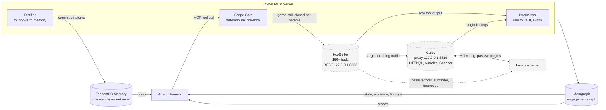

# Jcyber - Plan

## 1. Goal

MCP toolkit for agent-driven pentesting. The agent harness (Claude Code, or
any MCP-capable LLM) is the reasoning loop. Jcyber provides scope-gated
tools, an evidence graph, a finding lifecycle, and long-term memory.

The framework enforces safety in code: every tool call passes through a
deterministic scope gate before reaching a scanner. The agent decides what to
scan and when; the code decides whether the target is allowed.

## 2. Roles

| Component | Owns | Does NOT do |
|-----------|------|-------------|
| Agent harness | Reasoning, sequencing, strategy | Scope enforcement, tool execution |
| Jcyber MCP server | Tool dispatch, scope gate, evidence normalization | Deciding what to scan next |
| HexStrike | Tool execution (150+ security tools) | Deciding, scoping |
| Memgraph | Engagement state (evidence, hypotheses, findings, decisions) | Tool execution |
| TencentDB (memory-core) | Cross-engagement recall and learning | Real-time state |
| Caido | Traffic substrate (proxy, logging, passive plugins) | Deciding, scoping |

**Caido** is infrastructure, not a decision-maker: every target-touching call
routes through Caido's local proxy (pinned at `127.0.0.1:8889`). Its plugin
verdicts (Autorize, Scanner) are evidence that enters the graph, never
decisions.

## 3. Architecture



Keep in sync with [`docs/diagrams.md`](docs/diagrams.md) (the canonical
copy) -- when the architecture changes, edit the diagram there and mirror
it here.

Data flows one way from target through tools into the graph. The agent reads
state from Memgraph and decides the next action. Caido logs wire traffic but
has no edge toward decisions.

## 4. MCP tools

### HexStrike tools (42, scope-gated)

Each tool takes `target` + optional `params`. The scope gate runs as a
pre-hook before every call.

**Recon (passive):** `subfinder_scan`, `amass_scan`, `gau_discovery`,
`waybackurls_discovery`, `paramspider_discovery`, `httpx_probe`, `wafw00f_scan`

**Recon (active):** `nmap_scan`, `rustscan_fast_scan`, `masscan_high_speed`,
`nikto_scan`, `katana_crawl`, `hakrawler_crawl`, `gobuster_scan`, `dirb_scan`,
`ffuf_scan`, `feroxbuster_scan`, `http_framework_test`

**Probing:** `nuclei_scan`, `sqlmap_scan`, `wpscan_analyze`, `dalfox_xss_scan`,
`xsser_scan`, `jaeles_vulnerability_scan`, `jwt_analyzer`, `api_fuzzer`,
`graphql_scanner`, `comprehensive_api_audit`, `arjun_scan`, `qsreplace`,
`http_repeater`, `browser_agent_inspect`, `netexec_scan`, `smbmap_scan`,
`enum4linux_scan`

**Fuzzing:** `wfuzz_scan` (+ `ffuf_scan`, `api_fuzzer`, `jaeles_vulnerability_scan`)

**Exploit (require operator confirmation):** `metasploit_run`,
`pwntools_exploit`, `hydra_attack`, `hashcat_crack`, `john_crack`,
`responder_credential_harvest`

### Management tools (10)

- `intake_target` - create engagement from URL
- `get_state` - project current engagement state
- `create_hypothesis` - H-### from evidence
- `promote_finding` - hypothesis to finding (F-###)
- `score_finding` - set severity (none/low/medium/high/critical)
- `retire_hypothesis` - mark hypothesis as false/untestable
- `render_findings_report` - Markdown report from graph
- `get_decision_trace` - audit trail
- `recall_lessons` - TencentDB recall
- `commit_learnings` - distill and commit to long-term memory

### Jev classifiers (2, optional accelerators)

- `suggest_severity` - fast severity classification for a finding
- `check_duplicate` - check if new evidence duplicates existing

## 5. Safety

- **Scope gate:** deterministic string matching against `scope.toon`, enforced
  as a pre-hook in `mcp_server.py` on every tool call. Not prompt-bypassable.
  Out-of-scope targets are rejected before reaching HexStrike.
- **Fuzzing gate:** paths listed in `no_fuzzing_on` are blocked for fuzzing tools.
- **Exploit confirmation:** exploit tools return a confirmation prompt instead
  of executing. The operator must approve.
- **Evidence normalization:** all tool output is sha256-hashed, deduped, and
  stored with full provenance.
- **No free-form command construction:** HexStrike calls use closed-set params
  (target from scope, surface from graph, sets from config).

## 6. Finding lifecycle

```
Evidence (E-###) -> Hypothesis (H-###) -> Finding (F-###) -> Validated Finding
```

- Evidence is auto-created when a scanning tool returns output.
- Hypotheses are testable claims created by the agent from evidence.
- Findings are confirmed hypotheses promoted by the agent.
- Validated findings have severity scores and linked evidence chains.

IDs are sequential per engagement (H-001, E-001, F-001), never reused.

## 7. Phases

| Phase | State |
|-------|-------|
| P0 - Skeleton (plan, schema, examples) | Done |
| P1 - Session brain (Memgraph) | Done |
| P2 - Hands wired (HexStrike + Caido) | Done |
| P3 - MCP server (54 tools, scope gate, CLI) | Done |
| P4 - Live verification (DVWA end-to-end) | Next |
| P5 - Operator UX (TUI, attack-chain viz) | Planned |

## 8. Risks and mitigations

| Risk | Mitigation |
|------|------------|
| Agent scans out-of-scope targets | Scope gate is code, not prompt. Deterministic string match before every tool call. |
| Agent runs exploit without approval | Exploit tools return confirmation prompt, never auto-execute. |
| Duplicate evidence floods graph | sha256 dedup on insert, vector similarity for near-dupes. |
| HexStrike tool fails | Graceful error return; agent picks alternative tool. |
| Memgraph unavailable | MCP server reports error; tools that need graph state fail explicitly. |

## 9. Source notes

- HexStrike v6 (clone, `master` `d689933`, 2026-09-19): MCP server
  `hexstrike_mcp.py` = 151 `@mcp.tool()` entries; REST on `:8888`. Its
  "Intelligent Decision Engine" is source-verified hard-coded heuristics (no
  model, no BYOK, no LLM client in `requirements.txt`). Jcyber never calls
  HexStrike's AI layer.
- Caido 0.57.1: proxy on `:8889`, GraphQL API, passive plugins (Autorize,
  Scanner). One project per engagement.
