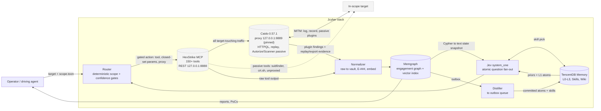
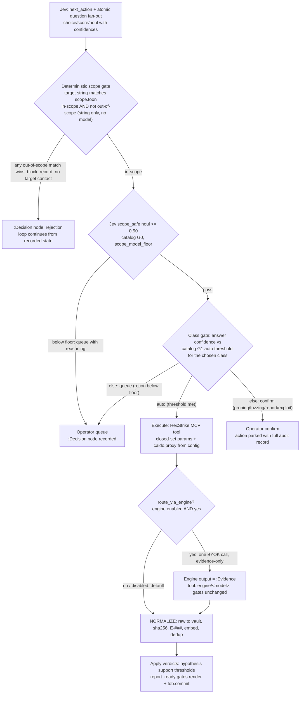

# Diagrams (Mermaid)

Single source of truth for the diagrams in this repo. `PLAN.md` §3 and
`README.md` link here — when the architecture changes, edit the diagram
here only.

## Stack architecture

Data flows one way except the operator interface. The cylinder nodes
(HexStrike, Caido, Memgraph, TencentDB) are the substrate the loop runs on:
data still flows one way across every edge into `DEC`, and Caido has no edge
toward the gate — one way in with findings, never with opinions.

## Decision gate (one loop iteration)

Notes:
- The deterministic gate runs on **every** action, before the model layer,
  and cannot be bypassed by any model answer (AGENTS.md invariant #3).
- `route_via_engine` is a Jev question, not a branch the engine controls:
  the engine augments an *already-gated* action and its output feeds the
  same dedup/hypothesis gates as any tool output (`orchestrator/loop.md`
  §3, `config/decision-catalog.md` G1).
- Thresholds shown are from the canonical set in
  `config/decision-catalog.md` (the one place per doc set they may live).