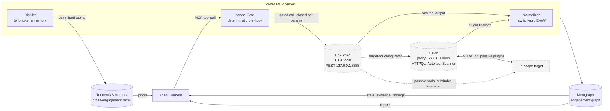
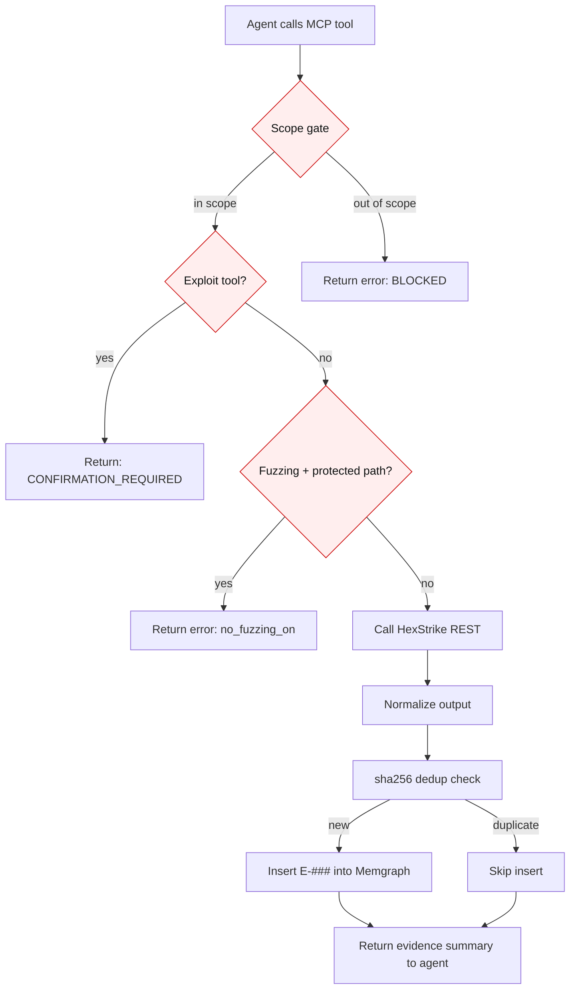
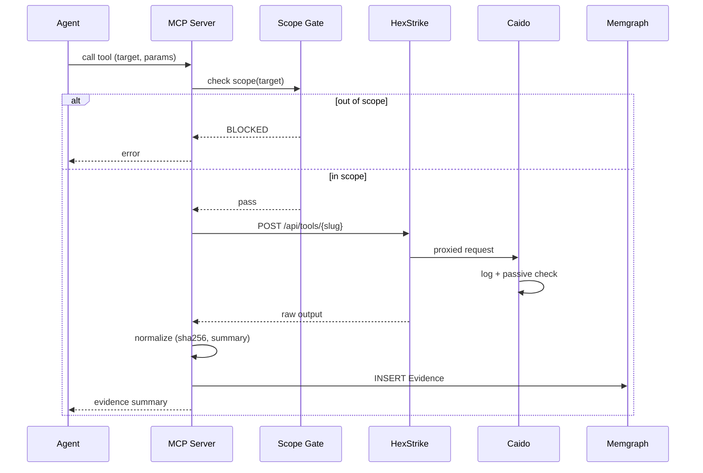

# Diagrams (Mermaid)

Single source of truth for the diagrams in this repo. `PLAN.md` and
`README.md` link here.

## Stack architecture

## Tool call flow (one MCP tool invocation)

## Service usage (per tool call)

How each system is used when the agent calls an MCP tool:

